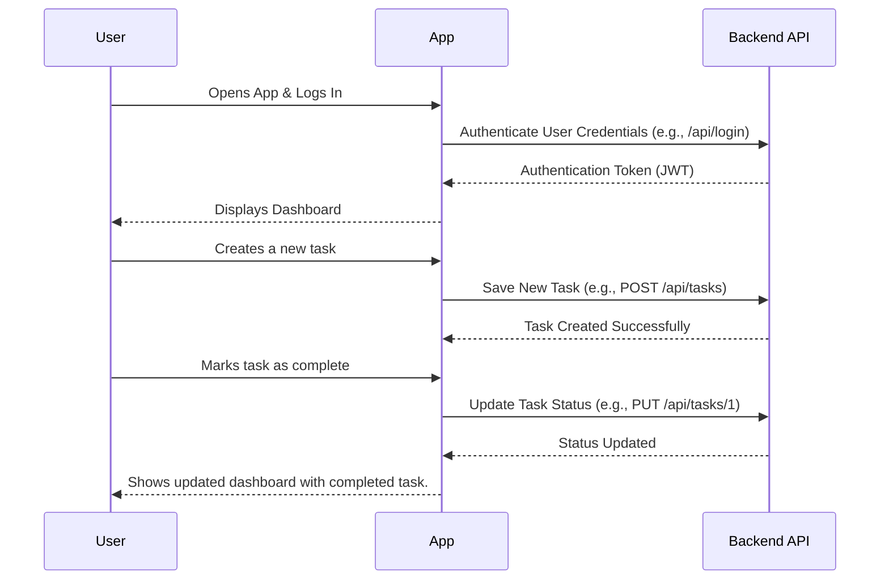

```mermaid
sequenceDiagram
    participant User
    participant App
    participant Backend API

    User->>App: Opens App & Logs In
    App->>Backend API: Authenticate User Credentials (e.g., /api/login)
    Backend API-->>App: Authentication Token (JWT)
    App-->>User: Displays Dashboard

    User->>App: Creates a new task
    App->>Backend API: Save New Task (e.g., POST /api/tasks)
    Backend API-->>App: Task Created Successfully

    User->>App: Marks task as complete
    App->>Backend API: Update Task Status (e.g., PUT /api/tasks/1)
    Backend API-->>App: Status Updated
    App-->>User: Shows updated dashboard with completed task.

```